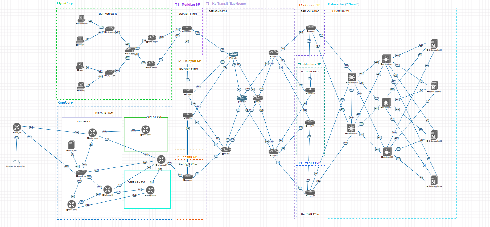
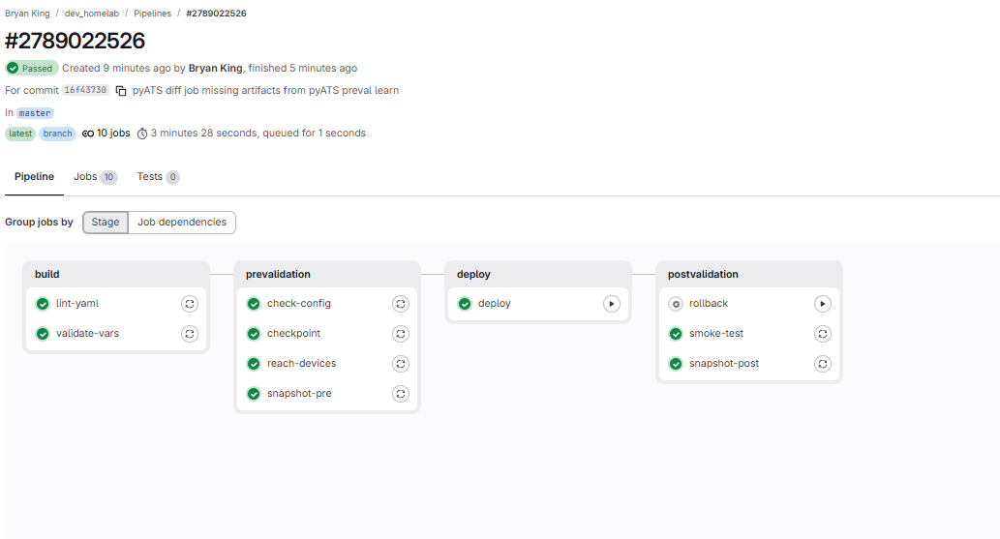

# Network as Code

**A CI/CD pipeline for network configuration, built from scratch in a homelab.**

Push a change to a YAML file. A pipeline lints it, validates it, takes a rollback checkpoint on every device, shows you exactly what would change, and waits. You click deploy. It applies the change, snapshots the network again, and hands you a diff of everything that moved.

That's the whole idea. This repo is how it got built, including the parts that didn't work.

---

## Why

On 05/23 I pushed an OSPF change to five routers. Three of them ended up in states I didn't intend: router-id under the wrong process on one, no network statements on another. I wrote this in my notes at the time:

> *I still have no idea how that happened.*

I fixed it by hand, comparing `show run` output across five terminals. It took an evening. Nothing about that process would have scaled to fifty devices, or 100, or 1000.

The problem wasn't that I was careless. The problem was that **my quality control was me, at the moment of the change, remembering to check things.** That works until you're tired, or it's 2am, or someone else touches the repo.

This pipeline moves the checking from "a person's discipline" to "a property of the system."

---

## The lab

EVE-NG on an old gaming PC, plus an Ubuntu VM that runs the automation.



Thirty-six devices across four sites, modelling a small internet: two customer networks buying transit, seven service providers with tiered peering relationships, and a spine-leaf datacenter.

| Zone | AS | Contents |
|---|---|---|
| **KingCorp** | 65512 | OSPF area 0 backbone, area 1 stub, area 2 NSSA |
| **FlynnCorp** | 65513 | Edge pair, distribution, access switches |
| **KingCorp Cloud** | 65520 | Two spines, three leaves, routed fabric |
| **Ku Transit** | 64502 | Tier 1 backbone, six P routers |
| **Corvid, Vantiq, Meridian, Zenith, Halcyon, Nimbus** | 64496–64501 | Tier 2, PE and P routers |
| **Management** | — | VRF `MGMT`, separate OSPF process, out-of-band from production |

Public-facing addressing uses `198.18.0.0/15` (RFC 2544, reserved for benchmarking) and documentation ASNs from `64496–64511` (RFC 5398). Both are unowned and unrouted, which makes them safe for modelling public infrastructure without borrowing someone else's identity.

Every device runs a second OSPF process (`900`) for production routing and process `1` inside VRF MGMT for management. That separation matters: **the pipeline reaches devices over the management plane, so breaking production routing doesn't cut off the tool that fixes it.**

`AUTO_box` is an Ubuntu VM on the management network running Docker, the GitLab runner, NetBox, and nothing else of consequence.

---

## Source of truth

NetBox holds the devices, interfaces, addresses, VRFs, and cables. Ansible's inventory is generated from it — there is no `hosts.ini`.

The reason to bother is structural. Thirty-six independent YAML files have no way to disagree with each other; two halves of a link that contradict is not an error state, because nothing relates them. NetBox models a cable as **one object with two terminations**, and refuses to terminate an interface twice.

Populating it surfaced five defects in a topology that had been running for weeks and looked healthy: a duplicate loopback causing a five-on-five-off ping pattern, a physical interface claimed by two links, a node built with fewer ports than the topology needed, a /24 facing a /30 on a transit, and six devices with unsaved config that a reload would have erased.

None of those would have surfaced from the YAML.

Groups are now derived rather than declared. A device is in `provider_edge` because its role is provider_edge, not because someone typed it under a heading:

```yaml
plugin: netbox.netbox.nb_inventory
api_endpoint: http://10.8.1.22:8080
group_names_raw: true
group_by: [device_roles, tenants, sites, platforms, tags]
```

Full detail, including the import scripts and what cost time: **[docs/source-of-truth.md](docs/source-of-truth.md)**

---

## What the pipeline does



Four stages. Nothing writes to a device until a human clicks a button.

### build, no network contact

| Job | What it catches |
|---|---|
| `lint-yaml` | Malformed YAML, trailing whitespace, duplicate keys, CRLF |
| `validate-vars` | Schema violations and referential integrity in the data model |

`validate_vars.py` is a hundred lines of plain Python. On its first run it found four bugs that had been sitting in the repo for weeks:

```
FAILED: 4 problem(s)

  x R1: route_map BLOCK_OSPF_TO_IBGP entry 0 is a str ('seq'), expected a mapping
  x R1: neighbor inet_rtr outbound_route_map=SEND_OSPF_TO_EBGP is undefined
  x R1: network 10.0.3.2 255.255.255.0 has host bits set
  x R4: network 10.0.34.65 255.255.255.252 has host bits set
```

None of those would have crashed anything. IOS accepts `network 10.0.3.2 255.255.255.0` and silently normalizes it. That's exactly why they survived: **they were wrong in the source of truth and invisible on the device.**

### prevalidation, read-only

| Job | What it does |
|---|---|
| `reach-devices` | Every device answers, credentials work |
| `checkpoint` | Saves a named config checkpoint to flash on each device |
| `snapshot-pre` | pyATS captures OSPF, BGP, interface, and routing state |
| `check-config` | Ansible `--check` mode: computes the delta, changes nothing |

The `check-config` artifact is the thing you actually read before deciding. It's also a free compliance report: anything it wants to change is a device that has drifted from intent.

### deploy, manual gate

One button. Nothing happens until it's pressed.

### postvalidation, evidence

| Job | What it does |
|---|---|
| `smoke-test` | Every device still answers. Hard gate |
| `snapshot-post` | Second pyATS capture, diffed against the pre-snapshot |
| `rollback` | Manual button. `configure replace` back to a checkpoint |

---

## Three toolchains, one intent

The same OSPF process gets configured three different ways in this repo, deliberately.

| Tool | Transport | What it's good at |
|---|---|---|
| **Ansible resource modules** | SSH, CLI parsing | Broad device support, stateless, reads the device every run |
| **RESTCONF scripts** | HTTPS, YANG | Structured end to end, no parsing, but device support is thin |
| **Terraform** `CiscoDevNet/iosxe` | NETCONF | Declarative with real state tracking and drift detection |

They're not redundant. Ansible works against anything with SSH, including IOL and vIOS nodes that have no API at all. RESTCONF is architecturally cleanest but only exists on newer IOS-XE. Terraform brings a state file, which is a fundamentally different model: Ansible asks the device what it looks like every run, Terraform remembers what it built.

That last difference is the one worth understanding. It also means **Terraform and Ansible must not manage the same resource** or they'll fight over ownership. In this lab the boundary is by device: Ansible owns the customer networks, Terraform owns the datacenter.

All three now read their inventory from NetBox.

---

## Rollback

Every deploy takes a named checkpoint to flash before it touches anything:

```
copy running-config flash:ckpt-20260823-095159.cfg
```

The checkpoint filename per device is published as a pipeline artifact, so the rollback job knows what to restore without any state living outside GitLab.

Restoring is one playbook that handles both cases:

```bash
# undo the last deploy
ansible-playbook playbooks/rollback/rollback_replace.yml

# go back to any checkpoint on flash
ansible-playbook playbooks/rollback/rollback_replace.yml \
  -e ckpt_override=ckpt-20260825-200225.cfg
```

The play lists every checkpoint on the device before deciding, so a failed rollback still tells you what you could have picked.

It's been tested three ways: single device with a deliberate break, lab-wide default, and lab-wide targeted at an older checkpoint. **An untested rollback is worse than none.** It gives you confidence at exactly the wrong moment.

---

## Design decisions

These are the parts worth arguing about, so here's the reasoning rather than just the config.

### Why the deploy is gated behind a button

It gives me a sense of control, and I can review how the code will be translated into a command structure, which I'm comfortable reading. It also lets me see which devices are currently in compliance, because the prevalidation stage inherently does that compliance check on every run.

### Why `configure replace` instead of replaying a saved config line by line

Because line by line isn't idempotent. Replaying an old config can only *add*. If the change I'm reverting created something the backup doesn't mention, nothing removes it, and I end up with the union of both states.

`configure replace` lets me get rid of config I might not even know will interfere with existing config. It lets me specify intent, and it saves me troubleshooting in the future when something breaks.

It also supports a dead-man switch, which is the right pattern for any change that could cut your own management path:

```
configure replace flash:ckpt-20260823-095159.cfg force revert trigger timer 5
```

If you don't issue `configure confirm` within five minutes, the device reverts itself.

### Why the pyATS diff warns instead of failing the pipeline

Because I may *want* there to be a change in state. New neighbors, new routes, new anything. The diff fails because some operational state changed, which is sometimes exactly what I asked for. I need to make that discernment before making the change, not have a script make it for me.

Part of why a vanilla developer would struggle with this: **you need to understand network engineering to read the diff.** That's a skill with a steep learning curve and it takes years. The tool can tell you *what* moved. It can't tell you whether that was the point.

So the diff is evidence, the human is the gate, and `smoke-test`, every device still reachable, is the only thing that fails the pipeline outright.

### Why the toolchain is containerized

Because with a container I don't have to worry about conflicting version requirements between different use cases. I want to build more containers for NetBox, monitoring, maybe security, and all of those have independent requirements that will cause a headache at some point.

It also saves resources, because they all run on Docker and share a host VM.

The concrete version of this: `AUTO_box` runs Ubuntu 20.04 with Python 3.8, which is EOL. `pip install pyats` there resolves to a two-year-old release and still collides with apt-installed packages. The same install inside `python:3.12-slim` just works. **The host stays legacy; the toolchain stays current.**

### Why NetBox sits on the management network, not in the datacenter

The datacenter is the more interesting home for it, and it was the original plan. But NetBox generates the inventory used to fix the network. Behind the fabric, a routing failure takes away the tool needed to repair it.

Same principle as running management in its own VRF: the thing that fixes the network must not depend on the network being healthy.

---

## Known gaps and workarounds

This section exists because a pipeline that only documents its successes isn't useful to anyone trying to build one.

**`ios_ospfv2` doesn't write stub area config.** The module's parser reads `area 1 stub` back as `{stub: {set: true}}`, and the argspec documents `stub` with `set` / `no_summary` / `no_ext_capability` suboptions, but no generated command ever appears. Read-side coverage without write-side coverage. Worked around with a small `ios_config` task that loops over the area definitions.

**No resource module covers `encapsulation dot1Q`.** Not in `ios_l3_interfaces`, not in `ios_interfaces`, not anywhere. Subinterface encapsulation needs an `ios_config` task, and it has to run *before* addressing or IOS rejects the `ip address` line.

**There is no EIGRP resource module at all.** Nor IS-IS, PBR, NAT, QoS, or MPLS. `gather_network_resources: all` genuinely means all — the set is just smaller than the feature set.

**`ios_ospfv2` reports `changed` on every run.** It emits a bare `router ospf 900` as a container for child commands, finds nothing to put under it, and emits the orphan anyway. `before` and `after` in its own output are byte-identical. Suppressed with:

```yaml
changed_when: >-
  ospf_result.commands | default([])
  | reject('match', '^router ospf \d+( vrf \S+)?$')
  | list | length > 0
```

**`ios_config` compares strings literally.** Any line pushed through it must match the running config exactly or the task can never report idempotent. A device with `area 1 stub no-summary` and a template rendering `area 1 stub` will push forever without converging. That's the cost of using `ios_config` as an escape hatch: you own string-level fidelity that a resource module would handle for you.

**GitLab `needs:` scopes artifact downloads.** By default a job downloads artifacts from every prior stage. The moment you add `needs:`, it downloads only from the jobs you named. This bit twice: once when `snapshot-post` couldn't see the pre-snapshot and diffed against an empty directory, and again when `rollback` couldn't see the checkpoint filenames. Both looked like unrelated bugs.

**Check mode validates the module, not the device.** `--check` proves Ansible can compute a command from your data. It never sends it, so the device never gets to reject it. `ip address 10.20.20.1 255.255.255.255` passed check mode and was refused by IOS as a bad mask for a point-to-point link.

**NetBox enforces IP uniqueness on the host address, not the CIDR.** A stale `10.0.3.2/24` blocks creating `10.0.3.2/30`. Duplicate checks should query by host address and report the conflict rather than failing on the POST.

**vIOS has no LACP, so `gather_network_resources: all` aborts on it.** Fixed with a `gather_resources` variable: a restricted list for vIOS, `all` as the group default. The mixed-platform lesson generalizes — `all` means all the modules exist, not that the device supports them.

**Unlicensed CSR1000v is capped at 1000 kb/s.** Every download through the lab crawled at 100 KB/s for months before this surfaced. `show platform hardware throughput level` says so plainly. vIOS has no such cap, which is a good reason to use it anywhere an API isn't needed.

**Legacy SSH crypto.** IOS-XE 16.09.07 only offers `diffie-hellman-group14-sha1`. Debian 12 dropped SHA-1 KEX from its defaults, so the container couldn't negotiate at all. `ansible_ssh_common_args` had no effect because Ansible was defaulting to Paramiko, which ignores SSH config entirely. Fixed by switching to `ansible_network_cli_ssh_type: libssh` and baking the algorithm config into `/etc/ssh/ssh_config` in the image.

That last one is worth dwelling on. Every year the crypto floor rises and old gear sinks further below it. The long-run answer isn't weakening every client forever, it's a bastion allowed to speak legacy crypto with modern crypto everywhere else. That conversation is coming for a lot of OT networks.

**The pattern across all of these:** resource modules cover maybe 85% of a feature. You plan for the rest with `ios_config` and stop being surprised by it.

---

## Repo layout

```
├── .gitlab-ci.yml              pipeline definition
├── ansible.cfg
├── ci/Dockerfile               the toolchain image
├── inventories/lab/
│   ├── netbox.yml              dynamic inventory, replaces hosts.ini
│   ├── group_vars/             shared config shape
│   ├── host_vars/              per-device protocol intent
│   └── gathered/               device state pulled back as YAML
├── playbooks/
│   ├── prevalidation/          backup, checkpoint, state gathering
│   ├── routing/                OSPF and BGP via resource modules
│   ├── interfaces/
│   ├── rollback/               configure replace
│   └── quickies/               one-off operational tasks
├── pyats/
│   ├── testbeds/lab.yml
│   └── snapshots/              pre and post state captures
├── scripts/
│   ├── validate_vars.py        schema and referential integrity
│   ├── prettify.py             readable YAML from gathered state
│   ├── gen_bootstrap.py        per-device bootstrap from a link map
│   ├── netbox/                 device, interface, and cable import
│   ├── RESTCONF/               direct API work against IOS-XE
│   └── validation/
└── docs/
    ├── source-of-truth.md      NetBox model, imports, what it caught
    ├── lab-journal.md          daily notes since 05/02/26
    ├── addressing.md           IPAM schema and hostname convention
    └── diagrams/
```

---

## Running it

**Requirements:** Docker, a GitLab project, and devices you can reach.

Build the toolchain image:

```bash
docker build -t netauto:local ci/
```

Register a runner with `pull_policy = ["if-not-present"]` so it uses the local image rather than reaching for a registry.

Bring up NetBox:

```bash
cd ~/netbox && docker compose up -d
docker compose exec netbox /opt/netbox/netbox/manage.py createsuperuser
```

Set `NET_USERNAME`, `NET_PASSWORD`, `NET_ENABLE`, and `NETBOX_TOKEN` as masked CI/CD variables in GitLab. Locally, the same names live in a gitignored `.env`. One mechanism, two environments:

```yaml
ansible_user: "{{ lookup('env', 'NET_USERNAME') }}"
ansible_password: "{{ lookup('env', 'NET_PASSWORD') }}"
```

Working interactively:

```bash
docker run --rm -it -v "$PWD:/work" -w /work \
  -e NET_USERNAME -e NET_PASSWORD -e NET_ENABLE \
  -e NETBOX_API -e NETBOX_TOKEN \
  netauto:local bash
```

Check before you push. CI is the backstop, not the feedback loop:

```bash
yamllint inventories/ playbooks/
python scripts/validate_vars.py
ansible-playbook playbooks/routing/full_route_state.yml --check
```

---

## What I'd tell someone starting this

**Start with one thing that catches one bug.** My first pipeline job printed "hello" and told me nothing. The second one found four real defects in data I'd been reading for weeks. That's the moment it stops being an exercise.

**Run the checks locally first.** I burned three CI round trips on lint findings a two-second local command would have shown me.

**The tests are the product; the pipeline is just the trigger.** An empty pipeline that always passes is theater. So is a job where every task skips. I had one of those for a week and the recap said `failed=0` the whole time.

**A skipped task is silent, not safe.** `ok` means Ansible checked and the state was already correct. `skipped` means it never looked. Only one of those is evidence.

**A data model with relationships catches what a pile of files cannot.** Thirty-six YAML files describing half a link each will happily contradict each other forever. One object with two ends will not.

**Automation multiplies mistakes.** A bad manual change hits one device. A bad playbook hits two hundred. The gates matter *more* in automation than they did in the CLI era, not less.

**Most of the difficulty isn't the network.** It was git, line endings, version skew, and container plumbing. The OSPF was the easy part.

---

## Roadmap

- Drift detection: gather device state, diff against NetBox, fail the pipeline on mismatch. Without it a source of truth rots, and rots worse than having none, because people trust it
- NetBox config contexts replacing identity-shaped `group_vars`
- Generating the pyATS testbed from NetBox instead of maintaining it by hand
- Terraform against the datacenter, so the two IaC models can be compared directly
- Anycast service in the datacenter, with BGP health checking from the hosts
- Nornir for gather and drift detection at scale, threads rather than processes
- MPLS with simulated field sites
- A Flask front end over the whole thing

Full daily notes going back to the first day of the lab are in [docs/lab-journal.md](docs/lab-journal.md).

---

*Built while studying for CCNP Automation. The pipeline maps closely to the AUTOCOR v2.0 blueprint (infrastructure as code, change validation, secret management, source of truth), which was a happy accident rather than a plan.*
